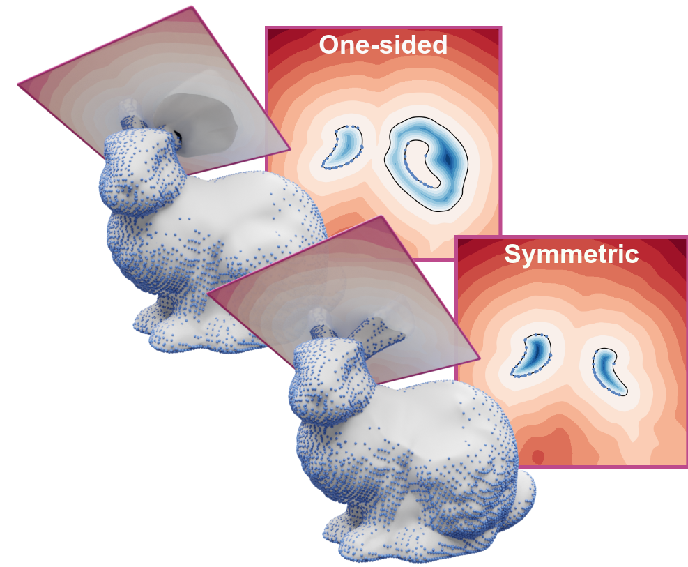
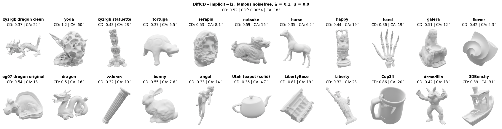

# DiffCD: A Symmetric Differentiable Chamfer Distance for Neural Implicit Surface Fitting

> **ECCV 2024**
>
> [Linus Härenstam-Nielsen](https://cvg.cit.tum.de/members/hael), [Lu Sang](https://sangluisme.github.io/), [Abhishek Saroha](https://cvg.cit.tum.de/members/saroha), [Nikita Araslanov](https://arnike.github.io/) and [Daniel Cremers](https://vision.in.tum.de/members/cremers)
>
> Technical University of Munich, Munich Center for Machine Learning
>
> [📄 Paper](https://arxiv.org/abs/2407.17058)



This repository contains the official implementation of the methods and experiments from the paper [DiffCD: A Symmetric Differentiable Chamfer Distance for Neural Implicit Surface Fitting](https://arxiv.org/abs/2407.17058).

**Abstract:**
Neural implicit surfaces can be used to recover accurate 3D geometry from imperfect point clouds. In this work, we show that state-of-the-art techniques work by minimizing an approximation of a one-sided Chamfer distance. This shape metric is not symmetric, as it only ensures that the point cloud is near the surface but not vice versa. As a consequence, existing methods can produce inaccurate reconstructions with spurious surfaces. Although one approach against spurious surfaces has been widely used in the literature, we theoretically and experimentally show that it is equivalent to regularizing the surface area, resulting in over-smoothing. As a more appealing alternative, we propose DiffCD, a novel loss function corresponding to the symmetric Chamfer distance. In contrast to previous work, DiffCD also assures that the surface is near the point cloud, which eliminates spurious surfaces without the need for additional regularization. We experimentally show that DiffCD reliably recovers a high degree of shape detail, substantially outperforming existing work across varying surface complexity and noise levels.

```text
@inproceedings{haerenstam2024diffcd,
    title = {DiffCD: A Symmetric Differentiable Chamfer Distance for Neural Implicit Surface Fitting},
    author = {L Härenstam-Nielsen and L Sang and A Saroha and N Araslanov and D Cremers},
    booktitle = {European Conference on Computer Vision (ECCV)},
    year = {2024},
    eprinttype = {arXiv},
    eprint = {2407.17058},
}
```

## 🛠️ Setup

Install requirements

```bash
pip install -r requirements.txt
```

Install jax version 0.4.14 matching your CUDA version as described [here](https://github.com/google/jax#pip-installation-gpu-cuda-installed-via-pip-easier). For example for CUDA 12:

```bash
pip install --upgrade "jax[cuda12_pip]==0.4.14" -f https://storage.googleapis.com/jax-releases/jax_cuda_releases.html
```

Other jax versions may also work, but have not been tested.

## 📏 Fit implicit function

The main interface for surface fitting is the training script `fit_implicit.py`. It takes a `.npy` point cloud as input and generates an implicit surface stored as an orbax checkpoint. You can also optionally provide a ground truth `.ply` mesh as input which is then used to compute evaluation metrics.
The methods are implemented as to be easy to use in a standalone fashion as well.

The repository also includes re-implementations of the loss functions from [IGR](https://arxiv.org/abs/2002.10099), [Neural-Pull](https://arxiv.org/abs/2011.13495) and [SIREN](https://arxiv.org/abs/2006.09661). If you use those implementations for a scientific publication please make sure to cite the corresponding papers.

Command line arguments are generated using [tyro](https://brentyi.github.io/tyro/). Some example uses:

```bash
# display command line options
python fit_implicit.py -h

# fit implicit function with diffcd
python fit_implicit.py --output-dir outputs --dataset.path DATASET_PATH/bunny.xyz.npy

# fit implicit function with diffcd and eikonal weight 0.5
python fit_implicit.py --output-dir outputs --dataset.path DATASET_PATH/bunny.xyz.npy method:diff-cd --method.eikonal-weight 0.5

# fit implicit function with IGR
python fit_implicit.py --yaml-config configs/config_igr.yaml --output-dir outputs --dataset.path DATASET_PATH/bunny.xyz.npy
```

To log metrics to wandb, add `--wandb-project [project name] --wandb-entity [username]` to the command line argument.

## 🔬 Analyzing the results

The outputs of `fit_implicit.py` should look like the following:

```yaml
checkpoints/ # orbax checkpoints per save step
    0
    1000
    ...
    40000
meshes/ # extracted mesh per save step
    mesh_0.ply
    mesh_1000.ply
    ...
    mesh_40000.ply
config.yaml # config used for reproducing  results
config.pickle # pickle file with the same config - yaml file loading can some times break when changing config structure

eval_metrics.csv # evaluation metrics per save step
eval_metrics_final_40000.csv # evaluation metrics for final shape
train_metrics.csv # training metrics

train_points.npy # training points in normalized coordinates
local_sigma.npy # local sigma used for generating sample points - for debugging purposes
```

We provide notebooks [evaluation.ipynb](evaluation.ipynb) and [levelset_figures.ipynb](levelset_figures.ipynb) for analyzing the results. They can be used to reproduce all tables and figures in the main paper (let us know if anything is missing!).

The notebook evaluation.ipynb can also be used to generate a per-shape breakdown of the metrics:



The same grid for other methods can be found under [images/results](images/results).

### Model checkpoints

(coming soon)

### Set up 3D visualizations

Generating 3D figures requires setting up a [blender-notebook kernel](https://github.com/cheng-chi/blender_notebook).
First, download and install [Blender](https://www.blender.org/). Then run:

```bash
pip install blender-notebook blender-plots ipykernel ipywidgets ipympl
blender_notebook install --blender-exec=BLENDER_INSTALL_PATH/blender-4.0.1-linux-x64/blender --kernel-name blender-diffcd
```

Modify `--blender-exec` to match your Blender install location.

Finally, open [evaluation.ipynb](evaluation.ipynb) or [levelset_figures.ipynb](levelset_figures.ipynb) in a notebook editor (e.g. VS Code) and select the kernel `blender-diffcd`.
This should launch the blender UI as a separate window, which uses the same python runtime as the notebook.
